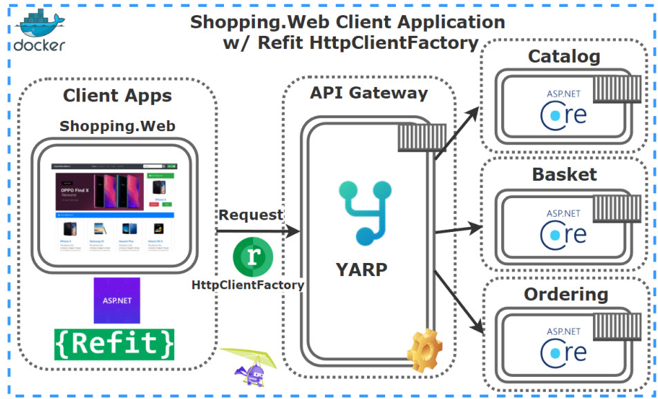
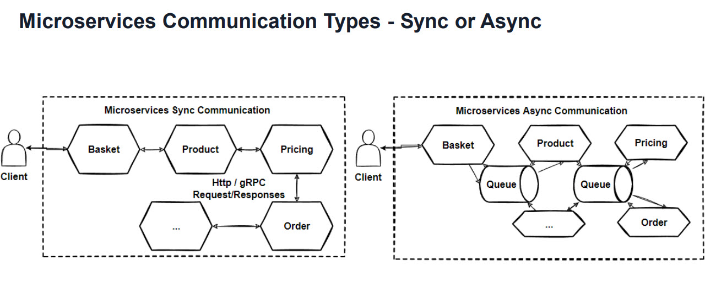
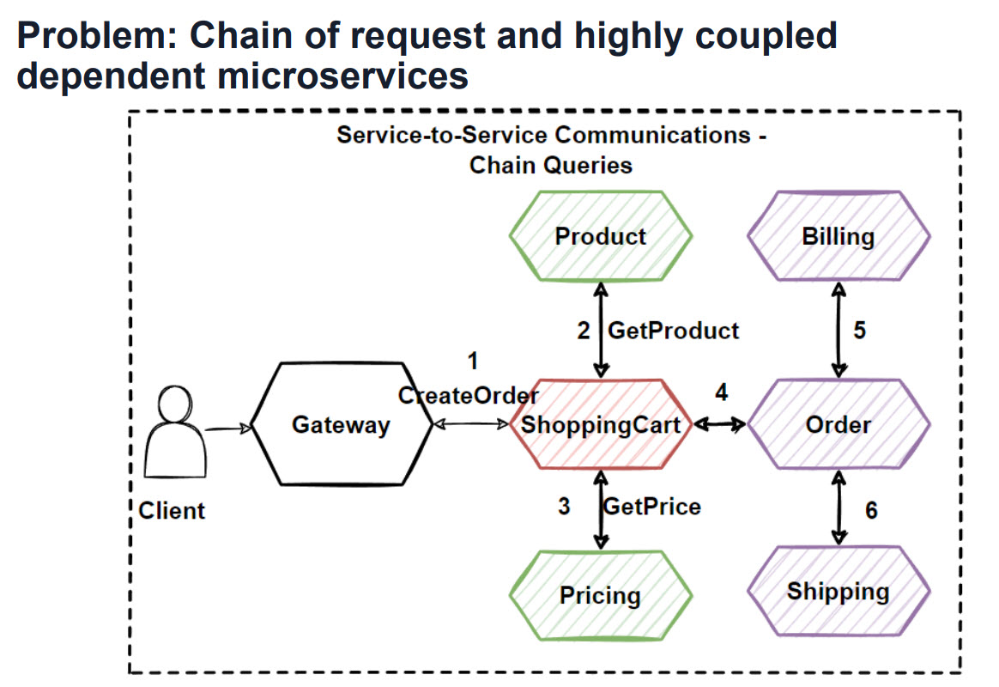
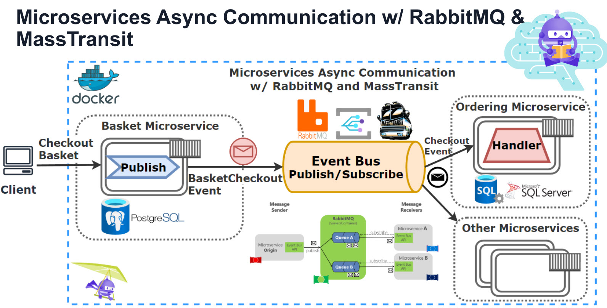
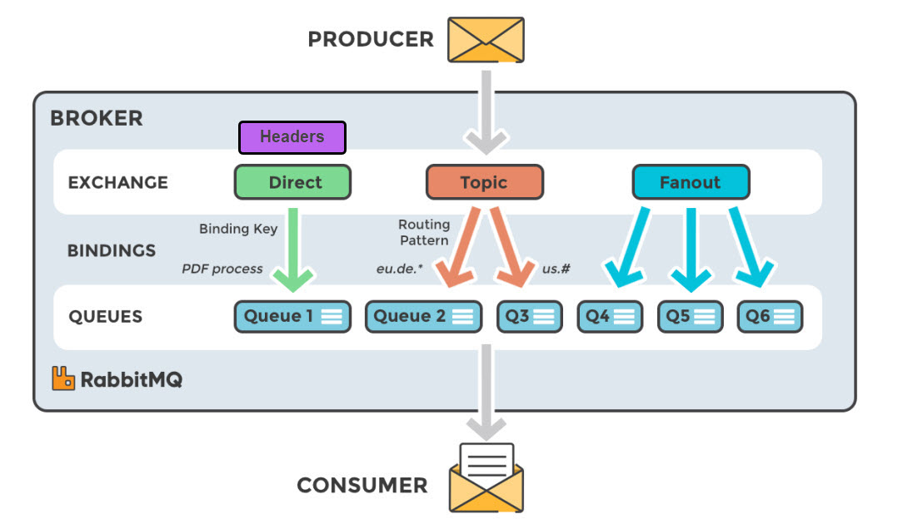
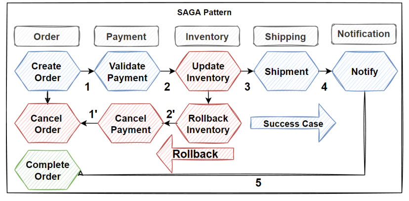

# eShop Microservice Architecture




There is a couple of microservices which implemented **e-commerce** modules over **Catalog, Basket, Discount** and **Ordering** microservices with **NoSQL (DocumentDb, Redis)** and **Relational databases (PostgreSQL, Sql Server)** with communicating over **RabbitMQ Event Driven Communication** and using **Yarp API Gateway**.

### Check Explanation of this Repository on Medium

* [.NET 8 Microservices: DDD, CQRS, Vertical/Clean Architecture and Event-Driven Communication](https://medium.com/@mehmetozkaya/net-8-microservices-ddd-cqrs-vertical-clean-architecture-2dd7ebaaf4bd) 

Under the hood, each microservice is communicating with one another using both synchronous (RESTful HTTP API and gRPC) and asychronously using [Event Driven Architecture](https://learn.microsoft.com/en-us/azure/architecture/patterns/event-sourcing).



For example, when the user checkouts from the basket, the Basket Service will clear its basket items and publish a BasketCheckoutEvent to Ordering Service and other microservices.(pg.427-444).





## Whats Including In This Repository

We have implemented below **features over the run-aspnetcore-microservices repository**. Each project will implement tech stacks of increasing complexity to demonstrate the application of each tech stack.

| Project                                              | Technology Stacks                                                                                                                                                                                                                                                                                                                                                                                                                                                                                                                                                                                                                                                                                                                                                                                                                                                                                                                                                                                                                                                                                                                                                                                                                                                                                                                                                                                                          |
| ---------------------------------------------------- | -------------------------------------------------------------------------------------------------------------------------------------------------------------------------------------------------------------------------------------------------------------------------------------------------------------------------------------------------------------------------------------------------------------------------------------------------------------------------------------------------------------------------------------------------------------------------------------------------------------------------------------------------------------------------------------------------------------------------------------------------------------------------------------------------------------------------------------------------------------------------------------------------------------------------------------------------------------------------------------------------------------------------------------------------------------------------------------------------------------------------------------------------------------------------------------------------------------------------------------------------------------------------------------------------------------------------------------------------------------------------------------------------------------------------- |
| [Catalog](./src/Services/Catalog/README/README.md)   | - [Vertical Slice Architecture](https://www.milanjovanovic.tech/blog/vertical-slice-architecture)<br/>- Document Persistence<br/>  - [PostgreSQL](https://www.postgresql.org)<br/>  - [Marten](https://github.com/JasperFx/marten) ORM<br/>- [CQRS pattern](https://learn.microsoft.com/en-us/azure/architecture/patterns/cqrs) + [Mediator pattern](https://refactoring.guru/design-patterns/mediator)<br/>  - [MediatR](https://github.com/jbogard/MediatR)<br/>- API Endpoints<br/>  - [Carter](https://github.com/CarterCommunity/Carter)<br/>  - [AutoRest](https://github.com/Azure/autorest)<br/>- Pipeline Behavior/ Middleware<br/>  - [Fluent Validation](https://github.com/FluentValidation/FluentValidation)<br/>  - [Error Handling](https://learn.microsoft.com/en-us/aspnet/core/fundamentals/error-handling)<br/>  - Logging<br/>  - Polly Retry Mechanism<br/>- Documentation<br/>  - Swagger API with [Swashbuckle](https://github.com/domaindrivendev/Swashbuckle.AspNetCore)<br/>- [Health Checks](https://github.com/Xabaril/AspNetCore.Diagnostics.HealthChecks)<br/>- Dependency Injection<br/>  - [Microsoft.Extensions.DependencyInjection](https://learn.microsoft.com/en-us/dotnet/core/extensions/dependency-injection)                                                                                                                                                                       |
| [Basket](./src/Services/Basket/README/README.md)     | - [Vertical Slice Architecture](https://www.milanjovanovic.tech/blog/vertical-slice-architecture)<br/>- Document Persistence with Repository Pattern<br/>  - [PostgreSQL](https://www.postgresql.org)<br/>  - [Marten](https://github.com/JasperFx/marten) ORM<br/>  - [Redis](https://github.com/redis/redis)<br/>- [CQRS pattern](https://learn.microsoft.com/en-us/azure/architecture/patterns/cqrs) + [Mediator pattern](https://refactoring.guru/design-patterns/mediator)<br/>  - [MediatR](https://github.com/jbogard/MediatR)<br/>- API Endpoints<br/>  - [Carter](https://github.com/CarterCommunity/Carter)<br/>  - [AutoRest](https://github.com/Azure/autorest)<br/>- Pipeline Behavior/ Middleware<br/>  - [Fluent Validation](https://github.com/FluentValidation/FluentValidation)<br/>  - [Error Handling](https://learn.microsoft.com/en-us/aspnet/core/fundamentals/error-handling)<br/>  - Logging<br/>  - Polly Retry Mechanism<br/>- Documentation<br/>  - Swagger API with [Microsoft.AspNetCore.OpenApi](https://learn.microsoft.com/en-us/aspnet/core/fundamentals/openapi/aspnetcore-openapi)<br/>- [Health Checks](https://github.com/Xabaril/AspNetCore.Diagnostics.HealthChecks)<br/>- Dependency Injection<br/>  - [Microsoft.Extensions.DependencyInjection](https://learn.microsoft.com/en-us/dotnet/core/extensions/dependency-injection) + [Scrutor](https://github.com/khellang/Scrutor) |
| [Discount](./src/Services/Discount/README/README.md) | - [N-Tiered Layered Architecture](https://www.c-sharpcorner.com/blogs/layered-ntier-architecture-in-net-core)<br/>- Relational Persistence<br/>  - [SQLite](https://sqlite.org/)<br/>  - [EF Core](https://github.com/dotnet/efcore)<br/>- API Endpoints<br/>  - [gRPC](https://github.com/grpc/grpc-dotnet)<br/>  - Asp.Net Controller<br/>- Pipeline Behavior/Middleware<br/>  - [Fluent Validation](https://github.com/FluentValidation/FluentValidation)<br/>  - [Error Handling](https://learn.microsoft.com/en-us/aspnet/core/fundamentals/error-handling)<br/>  - Logging<br/>- Documentation<br/>  - Swagger API<br/>- [Health Checks](https://github.com/Xabaril/AspNetCore.Diagnostics.HealthChecks)<br/>- Dependency Injection<br/>  - [Microsoft.Extensions.DependencyInjection](https://learn.microsoft.com/en-us/dotnet/core/extensions/dependency-injection)                                                                                                                                                                                                                                                                                                                                                                                                                                                                                                                                                |
| [Ordering](./src/Services/Ordering/README/README.md) | - [Clean Architecture](https://learn.microsoft.com/en-us/dotnet/architecture/modern-web-apps-azure/common-web-application-architectures#clean-architecture)<br/>  - DDD (Domain Driven Design)<br/>    - Anemic Domain vs Rich Domain Entities<br/>- Relational Persistence + Event Store<br/>  - MSSQL<br/>  - [EF Core](https://github.com/dotnet/efcore)<br/>- API Endpoints<br/>  - [Fast Endpoints](https://github.com/FastEndpoints/FastEndpoints)<br/>- Pipeline Behavior/Middleware<br/>  - [Fluent Validation](https://github.com/FluentValidation/FluentValidation)<br/>  - [Error Handling](https://learn.microsoft.com/en-us/aspnet/core/fundamentals/error-handling)<br/>  - Logging<br/>- Documentation<br/>  - [NSwag](https://github.com/RicoSuter/NSwag)<br/>  - [Redoc](https://github.com/Redocly/redoc)<br/>  - Swagger API<br/>- [Health Checks](https://github.com/Xabaril/AspNetCore.Diagnostics.HealthChecks)<br/>- Dependency Injection<br/>  - [Microsoft.Extensions.DependencyInjection](https://learn.microsoft.com/en-us/dotnet/core/extensions/dependency-injection)                                                                                                                                                                                                                                                                                                                         |
| Shopping                                             | - Presentation layer for the solution using [N-Tiered Layered Architecture](https://www.c-sharpcorner.com/blogs/layered-ntier-architecture-in-net-core).                                                                                                                                                                                                                                                                                                                                                                                                                                                                                                                                                                                                                                                                                                                                                                                                                                                                                                                                                                                                                                                                                                                                                                                                                                                                   |

#### Catalog microservice

* ASP.NET Core Minimal APIs and latest features of .NET8 and C# 12
* **Vertical Slice Architecture** implementation with Feature folders and single .cs file includes different classes in one file
* CQRS implementation using MediatR library
* CQRS Validation Pipeline Behaviors with MediatR and FluentValidation
* Use Marten library for .NET Transactional Document DB on PostgreSQL
* Use Carter for Minimal API endpoint definition
* Cross-cutting concerns Logging, Global Exception Handling and Health Checks

#### Basket microservice

* ASP.NET 8 Web API application, Following REST API principles, CRUD
* Using **Redis** as a **Distributed Cache** over basketdb
* Implements Proxy, Decorator and Cache-aside patterns
* Consume Discount **Grpc Service** for inter-service sync communication to calculate product final price
* Publish BasketCheckout Queue with using **MassTransit and RabbitMQ**

#### Discount microservice which includes;

* ASP.NET **Grpc Server** application
* Build a Highly Performant **inter-service gRPC Communication** with Basket Microservice
* Exposing Grpc Services with creating **Protobuf messages**
* Entity Framework Core ORM — SQLite Data Provider and Migrations to simplify data access and ensure high performance
* **SQLite database** connection and containerization

#### Microservices Communication

* Sync inter-service **gRPC Communication**
* Async Microservices Communication with **RabbitMQ Message-Broker Service**
* Using **RabbitMQ Publish/Subscribe Topic** Exchange Model
* Using **MassTransit** for abstraction over RabbitMQ Message-Broker system
* Publishing BasketCheckout event queue from Basket microservices and Subscribing this event from Ordering microservices    
* Create **RabbitMQ EventBus.Messages library** and add references Microservices

#### Ordering Microservice

* Implementing **DDD, CQRS, and Clean Architecture** with using Best Practices
* Developing **CQRS with using MediatR, FluentValidation and Mapster packages**
* Consuming **RabbitMQ** BasketCheckout event queue with using **MassTransit-RabbitMQ** Configuration
* **SqlServer database** connection and containerization
* Using **Entity Framework Core ORM** and auto migrate to SqlServer when application startup

#### Yarp API Gateway Microservice

* Develop API Gateways with **Yarp Reverse Proxy** applying Gateway Routing Pattern
* Yarp Reverse Proxy Configuration; Route, Cluster, Path, Transform, Destinations
* **Rate Limiting** with FixedWindowLimiter on Yarp Reverse Proxy Configuration

#### WebUI ShoppingApp Microservice

* ASP.NET Core Web Application with Bootstrap 4 and Razor template
* Call **Yarp APIs with Refit HttpClientFactory**

#### Docker Compose establishment with all microservices on docker;

* Containerization of microservices
* Containerization of databases
* Override Environment variables

## Run The Project

You will need the following tools:

* [Visual Studio 2022](https://visualstudio.microsoft.com/downloads/)
* [.Net Core 8 or later](https://dotnet.microsoft.com/download/dotnet-core/8)
* [Docker Desktop](https://www.docker.com/products/docker-desktop)

### Installing

Follow these steps to get your development environment set up: (Before Run Start the Docker Desktop)

1. Clone the repository

2. Once Docker for Windows is installed, go to the **Settings > Advanced option**, from the Docker icon in the system tray, to configure the minimum amount of memory and CPU like so:
* **Memory: 4 GB**

* CPU: 2
3. At the root directory of solution, select **docker-compose** and **Set a startup project**. **Run docker-compose without debugging on visual studio**.
   Or you can go to root directory which include **docker-compose.yml** files, run below command:
   
   ```csharp
   docker-compose -f docker-compose.yml -f docker-compose.override.yml up -d
   ```

4. Wait for docker compose all microservices. That’s it! (some microservices need extra time to work so please wait if not worked in first shut)

5. Launch **Shopping Web UI -> https://localhost:6065** in your browser to view index page. You can use Web project in order to **call microservices over Yarp API Gateway**. When you **checkout the basket** you can follow **queue record on RabbitMQ dashboard**.


## Endpoints

The following are the endpoints of each microservice and their dependent services exposed endpoints in the local machine environment. Do note that all of these are hosted in the Docker and you can refer to the [`docker-compose.override.yml`](./src/docker-compose.override.yml) for more information.

| Service               | Local Endpoint                                                        | Internal Endpoint                                       |
| --------------------- | --------------------------------------------------------------------- | ------------------------------------------------------- |
| Catalog               | http://localhost:6000 <br/>https://localhost:6060                     | http://catalog.api:8080 <br/>https://catalog.api:8081   |
| Catalog DB (Postgres) | http://localhost:5432                                                 |                                                         |
| Basket                | http://localhost:6001 <br/>https://localhost:6061                     | http://basket.api:8080 <br/>https://basket.api:8081     |
| Basket DB (Postgres)  | http://localhost:5433                                                 |                                                         |
| Discount              | grpc://localhost:6062                                                 | grpc://discount.api:8081                                |
| Ordering              | http://localhost:6003 <br/>https://localhost:6063                     | http://ordering.api:8080 <br/>https://ordering.api:8081 |
| Order DB (MSSQL)      | http://localhost:1433                                                 |                                                         |
| Yarp Reverse Proxy    | http://localhost:6004 <br/>https://localhost:6064                     |                                                         |
| Shopping Web          | http://localhost:6005 <br/>https://localhost:6065                     |                                                         |
| Redis Cache           | http://localhost:6379                                                 |                                                         |
| RabbitMQ Broker       | Service: http://localhost:5672 <br/>Dashboard: http://localhost:15672 |                                                         |

## Authors

* **Mehmet Ozkaya** - *Initial work* - [mehmetozkaya](https://github.com/mehmetozkaya)
* **Alex Soh** - Extensions -  [Alex Soh]([takato1314 (Alex Soh) · GitHub](https://github.com/takato1314))

See also the list of [contributors](https://github.com/aspnetrun/run-core/contributors) who participated in this project. Check also [gihtub page of repository.](https://aspnetrun.github.io/run-aspnetcore-angular-realworld/)
