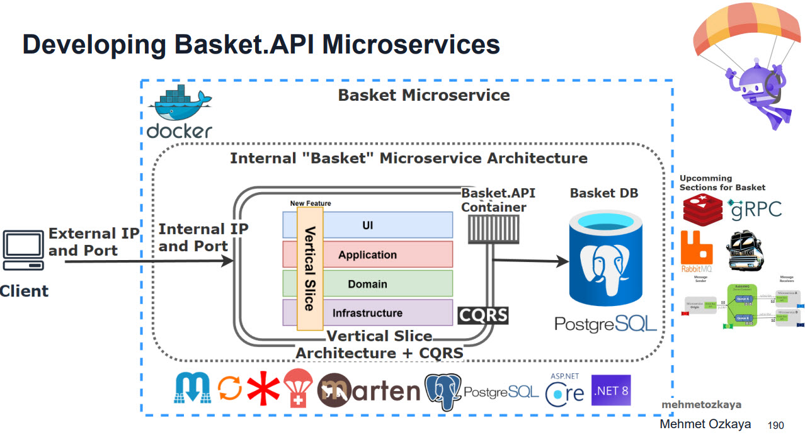
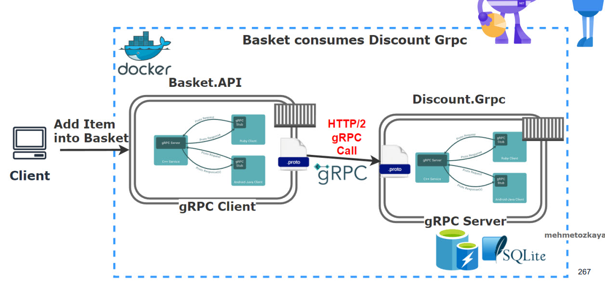
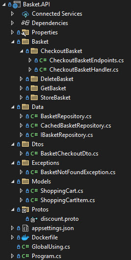
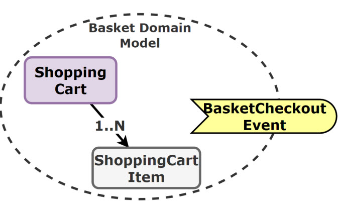

# Basket.API

The Basket API is a managing shopping cart operations in the application. It allows:

- Get shopping cart with items

- Store (Upsert, Create and Delete) shopping cart with items

- Apply discount on items

- Checkout basket

## Getting Started

You can run the project with the following ways:

- Visual Studio 2022
  
  | Profile        | Description                                                                                                                    |
  | -------------- | ------------------------------------------------------------------------------------------------------------------------------ |
  | Web            | The web profile hosts the application under the port 5001 for http and port 5051 for https.                                    |
  | Docker         | The docker profile exposes http at 8080 and https at 8081.                                                                     |
  | Docker Compose | The docker compose contains all microservices and their dependencies in this solution. Exposes http at 6001 and https at 6061. |

- Visual Studio Code

## Architecture

The Basket API is built using a [Vertical Slice Architecture](https://www.milanjovanovic.tech/blog/vertical-slice-architecture). It consists of the following components:

| Component                                                                                                             | Description                                                                                                                                                                                                                                                                                                                                                                                                                                                                     |
| --------------------------------------------------------------------------------------------------------------------- | ------------------------------------------------------------------------------------------------------------------------------------------------------------------------------------------------------------------------------------------------------------------------------------------------------------------------------------------------------------------------------------------------------------------------------------------------------------------------------- |
| [PostgreSQL](https://www.postgresql.org)                                                                              | A relational database used to store product information as JSON document.                                                                                                                                                                                                                                                                                                                                                                                                       |
| [Marten](https://github.com/JasperFx/marten)                                                                          | The Marten library is an ORM (Object Relational Mapper) that provides .NET developers with the ability to use the proven PostgreSQL database engine and its fantastic JSON support as a fully fledged [document database](https://en.wikipedia.org/wiki/Document-oriented_database).                                                                                                                                                                                            |
| [Redis Cache](https://www.nuget.org/packages/microsoft.extensions.caching.stackexchangeredis)                         | A powerful in-memory data store and distributed cache which is good fit for microservices arcihtecture.  The following design patterns are used:   - [Proxy Pattern](https://refactoring.guru/design-patterns/proxy/csharp/example) + [Decorator Pattern](https://refactoring.guru/design-patterns/decorator/csharp/example) + Scrutor   - [Cache aside Pattern](https://learn.microsoft.com/en-us/azure/architecture/patterns/cache-aside)/ Cache Invalidation |
| [Scrutor](https://github.com/khellang/Scrutor)                                                                        | .NET library that extends the built-in IOC container of ASP.NET Core. It provides additional capabilities to scan and register services in a more flexible way.                                                                                                                                                                                                                                                                                                                 |
| [MediatR](https://github.com/jbogard/MediatR)                                                                         | MediatR helps to implement the [Mediator pattern](https://refactoring.guru/design-patterns/mediator) and [CQRS pattern](https://learn.microsoft.com/en-us/azure/architecture/patterns/cqrs), which promotes loose coupling between components by allowing them to communicate through a central mediator rather than directly.  Uses `IPipelineBehavior` to introduce middleware concept.                                                                               |
| [Carter](https://github.com/CarterCommunity/Carter)                                                                   | Routing and handling HTTP requests, easier to define API endpoints with clean and concise code.                                                                                                                                                                                                                                                                                                                                                                                 |
| [Mapster](https://github.com/MapsterMapper/Mapster)                                                                   | Mapster is a fast, configurable object mapper that simplifies the task of mapping objects.                                                                                                                                                                                                                                                                                                                                                                                      |
| [Fluent Validation](https://github.com/FluentValidation/FluentValidation)                                             | For building strongly-typed validation rules, ensure inputs are correct before processed.                                                                                                                                                                                                                                                                                                                                                                                       |
| [Microsoft.AspNetCore.OpenApi](https://learn.microsoft.com/en-us/aspnet/core/fundamentals/openapi/aspnetcore-openapi) | Provides built-in support for OpenAPI document generation in ASP.NET Core.                                                                                                                                                                                                                                                                                                                                                                                                      |
| [Openapi-generator](https://github.com/OpenAPITools/openapi-generator)                                                | OpenAPI Generator allows generation of API client libraries (SDK generation), server stubs, documentation and configuration automatically given an OpenAPI Spec (v2, v3)                                                                                                                                                                                                                                                                                                        |
| [RestEase](https://github.com/canton7/RestEase)                                                                       | Easy-to-use typesafe REST API client library for .NET Standard 1.1 and .NET Framework 4.5 and higher, which is simple and customisable. Inspired by Refit                                                                                                                                                                                                                                                                                                                       |
| [Health Checks](https://github.com/Xabaril/AspNetCore.Diagnostics.HealthChecks)                                       | Enterprise HealthChecks for ASP.NET Core Diagnostics Package                                                                                                                                                                                                                                                                                                                                                                                                                    |

Apart from the exposed Restful APIs, the Basket microservice also uses the following communication protocols:

- gRPC
  
  
  The Basket Microservice will act as a gRPC client to consume services exposed by the Discount Grpc Service.

## Project Structure

This project is organized in the following ways:

| Layer   | Description                                                                                       |
| ------- | ------------------------------------------------------------------------------------------------- |
| Feature | Each features like CheckoutBasket and GetBasket have dedicated handlers and endpoint definitions. |
| Model   | Contains the entities used by the Feature.                                    |
| Data    | Contains Repository objects that manages database and cache interactions.                         |
| Dtos    | DTO (Data Transfer Objects).                                                                      |
| Protos  | Contains protobuf configurations.                                                                 |