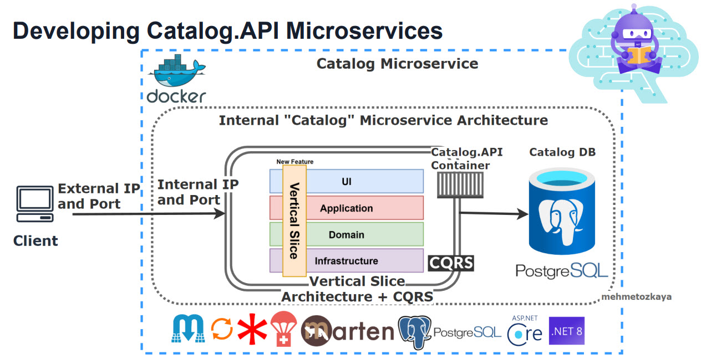
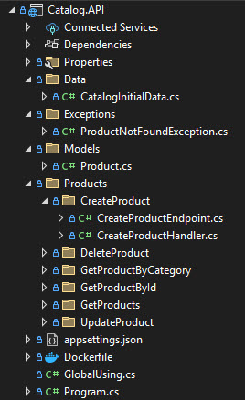
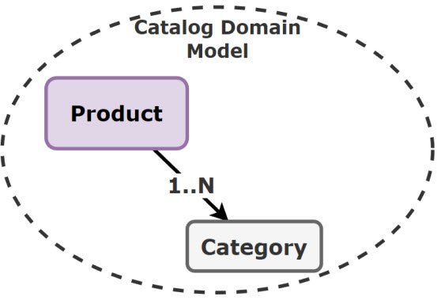

# Catalog.API

The Catalog API is a service that provides access to a catalog of products. It allows: 

- Users to search for products

- View product details

- Manage their product listings.

## Getting Started

You can run the project with the following ways:

- Visual Studio 2022
  
  | Profile        | Description                                                                                                                    |
  | -------------- | ------------------------------------------------------------------------------------------------------------------------------ |
  | Web            | The web profile hosts the application under the port 5000 for http and port 5050 for https.                                    |
  | Docker         | The docker profile exposes http at 8080 and https at 8081.                                                                     |
  | Docker Compose | The docker compose contains all microservices and their dependencies in this solution. Exposes http at 6000 and https at 6060. |

- Visual Studio Code

## Architecture

The Catalog API is built using a [Vertical Slice Architecture](https://www.milanjovanovic.tech/blog/vertical-slice-architecture). It consists of the following components:

| Component                                                                       | Description                                                                                                                                                                                                                                                                                                                                                                                       |
| ------------------------------------------------------------------------------- | ------------------------------------------------------------------------------------------------------------------------------------------------------------------------------------------------------------------------------------------------------------------------------------------------------------------------------------------------------------------------------------------------- |
| [PostgreSQL](https://www.postgresql.org)                                        | A relational database used to store product information as JSON document.                                                                                                                                                                                                                                                                                                                         |
| [Marten](https://github.com/JasperFx/marten)                                    | The Marten library is an ORM (Object Relational Mapper) that provides .NET developers with the ability to use the proven PostgreSQL database engine and its fantastic JSON support as a fully fledged [document database](https://en.wikipedia.org/wiki/Document-oriented_database).                                                                                                              |
| [Sable](https://github.com/bloomberg/sable)                                     |                                                                                                                                                                                                                                                                                                                                                                                                   |
| [MediatR](https://github.com/jbogard/MediatR)                                   | MediatR helps to implement the [Mediator pattern](https://refactoring.guru/design-patterns/mediator) and [CQRS pattern](https://learn.microsoft.com/en-us/azure/architecture/patterns/cqrs), which promotes loose coupling between components by allowing them to communicate through a central mediator rather than directly.  Uses `IPipelineBehavior` to introduce middleware concept. |
| [Carter](https://github.com/CarterCommunity/Carter)                             | Routing and handling HTTP requests, easier to define API endpoints with clean and concise code.                                                                                                                                                                                                                                                                                                   |
| [Mapster](https://github.com/MapsterMapper/Mapster)                             | Mapster is a fast, configurable object mapper that simplifies the task of mapping objects.                                                                                                                                                                                                                                                                                                        |
| [Fluent Validation](https://github.com/FluentValidation/FluentValidation)       | For building strongly-typed validation rules, ensure inputs are correct before processed.                                                                                                                                                                                                                                                                                                         |
| [Swashbuckle](https://github.com/domaindrivendev/Swashbuckle.AspNetCore)        | [Swagger](https://swagger.io/) tooling for APIs built with ASP.NET Core.                                                                                                                                                                                                                                                                                                                          |
| [AutoRest](https://github.com/Azure/autorest)                                   | OpenAPI (f.k.a Swagger) Specification code generator. Supports C#, PowerShell, Go, Java, Node.js, TypeScript, Python                                                                                                                                                                                                                                                                              |
| [Health Checks](https://github.com/Xabaril/AspNetCore.Diagnostics.HealthChecks) | Enterprise HealthChecks for ASP.NET Core Diagnostics Package                                                                                                                                                                                                                                                                                                                                      |

## Project Structure

This project is organized in the following ways:

| Layer   | Description                                                                                       |
| ------- | ------------------------------------------------------------------------------------------------- |
| Feature | Each features like CreateProduct and GetProduct have dedicated handlers and endpoint definitions. |
| Model   | Contains the entities used by the Feature.                                    |
| Data    | Contains Context objects that manages database interactions.                                      |