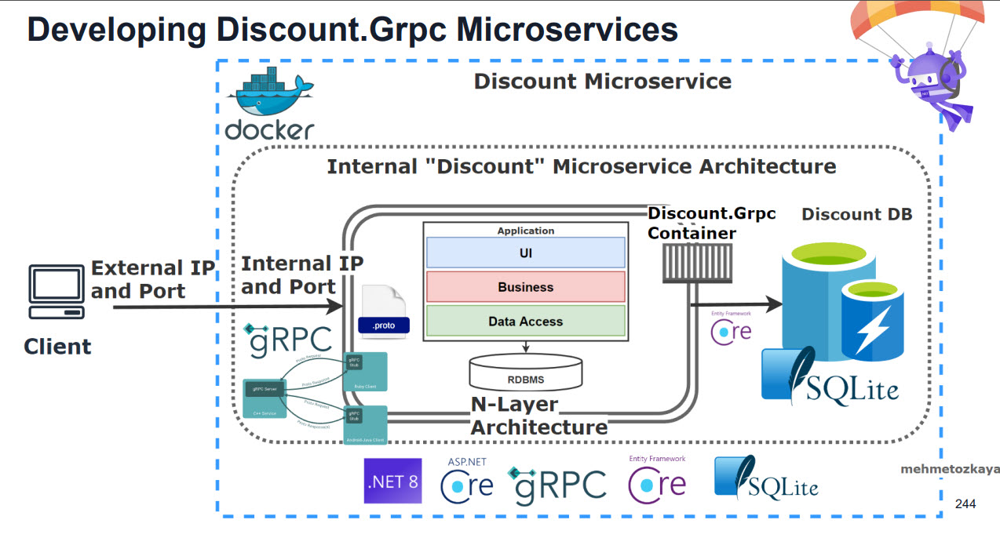
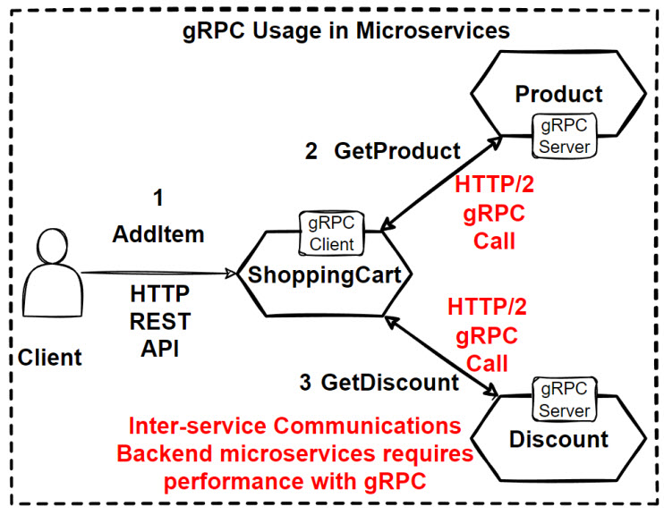
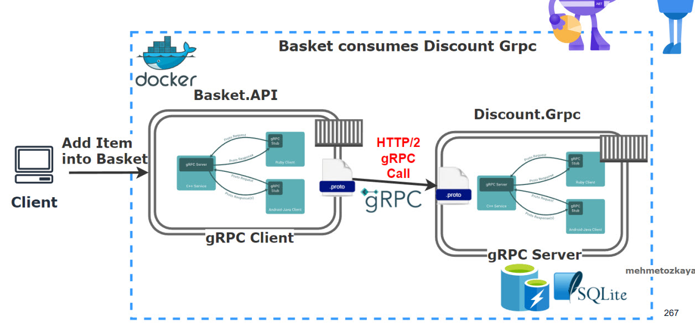
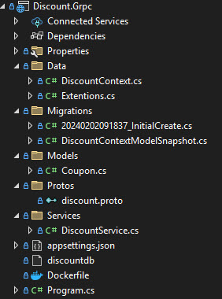
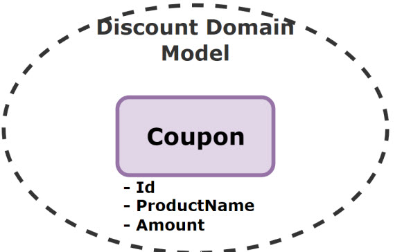

# Discount.API

The Discount API is a managing discount operations for the shopping cart from [Basket API](./../../Basket/README/README.md). It allows:

- Apply discounts onto shopping cart.
  
  - When client add item into shopping cart, Basket microservice will consume this discount grpc services, to get latest discounts on that product item.

## Getting Started

You can run the project with the following ways:

- Visual Studio 2022
  
  | Profile        | Description                                                                                                                    |
  | -------------- | ------------------------------------------------------------------------------------------------------------------------------ |
  | Web            | The web profile hosts the application under the port 5002 for http and port 5052 for https.                                    |
  | Docker         | The docker profile exposes http at 8080 and https at 8081.                                                                     |
  | Docker Compose | The docker compose contains all microservices and their dependencies in this solution. Exposes http at 6002 and https at 6062. |

- Visual Studio Code

## Architecture

The Discount API is built using a [N-Tiered Layered Architecture](https://www.c-sharpcorner.com/blogs/layered-ntier-architecture-in-net-core). It consists of the following components:

| Component                                                                                                             | Description                                                                                                                                                                                                                                                                                                                                                                                       |
| --------------------------------------------------------------------------------------------------------------------- | ------------------------------------------------------------------------------------------------------------------------------------------------------------------------------------------------------------------------------------------------------------------------------------------------------------------------------------------------------------------------------------------------- |
| [SQLite](https://sqlite.org/)                                                                                         | SQLite is a C-language library that implements a small, fast, self-contained, high-reliability, full-featured, SQL database engine.  Chosen for its simplicity and efficiency, especially for small-scale data like discounts. It's embedded within the application, reducing the need for additional infrastructure.                                                                     |
| [gRPC](https://github.com/grpc/grpc-dotnet)                                                                           | gRPC Communications, Proto files CRUD operations. Expose Grpc Services by creating Protobuf messages.                                                                                                                                                                                                                                                                                             |
| [EF Core](https://github.com/dotnet/efcore)                                                                           | ORM for database operations.                                                                                                                                                                                                                                                                                                                                                                      |
| [Scrutor](https://github.com/khellang/Scrutor)                                                                        | .NET library that extends the built-in IOC container of ASP.NET Core. It provides additional capabilities to scan and register services in a more flexible way.                                                                                                                                                                                                                                   |
| [MediatR](https://github.com/jbogard/MediatR)                                                                         | MediatR helps to implement the [Mediator pattern](https://refactoring.guru/design-patterns/mediator) and [CQRS pattern](https://learn.microsoft.com/en-us/azure/architecture/patterns/cqrs), which promotes loose coupling between components by allowing them to communicate through a central mediator rather than directly.  Uses `IPipelineBehavior` to introduce middleware concept. |
| [Carter](https://github.com/CarterCommunity/Carter)                                                                   | Routing and handling HTTP requests, easier to define API endpoints with clean and concise code.                                                                                                                                                                                                                                                                                                   |
| [Mapster](https://github.com/MapsterMapper/Mapster)                                                                   | Mapster is a fast, configurable object mapper that simplifies the task of mapping objects.                                                                                                                                                                                                                                                                                                        |
| [Fluent Validation](https://github.com/FluentValidation/FluentValidation)                                             | For building strongly-typed validation rules, ensure inputs are correct before processed.                                                                                                                                                                                                                                                                                                         |
| [Microsoft.AspNetCore.OpenApi](https://learn.microsoft.com/en-us/aspnet/core/fundamentals/openapi/aspnetcore-openapi) | Provides built-in support for OpenAPI document generation in ASP.NET Core.                                                                                                                                                                                                                                                                                                                        |
| [Openapi-generator](https://github.com/OpenAPITools/openapi-generator)                                                | OpenAPI Generator allows generation of API client libraries (SDK generation), server stubs, documentation and configuration automatically given an OpenAPI Spec (v2, v3)                                                                                                                                                                                                                          |
| [RestEase](https://github.com/canton7/RestEase)                                                                       | Easy-to-use typesafe REST API client library for .NET Standard 1.1 and .NET Framework 4.5 and higher, which is simple and customisable. Inspired by Refit                                                                                                                                                                                                                                         |
| [Health Checks](https://github.com/Xabaril/AspNetCore.Diagnostics.HealthChecks)                                       | Enterprise HealthChecks for ASP.NET Core Diagnostics Package                                                                                                                                                                                                                                                                                                                                      |

Apart from the exposed Restful APIs, the Discount microservice also uses the following communication protocols:

- gRPC
  
  
  Discount Grpc Service will expose gRPC services to be consumed by others.
  
  

## Project Structure

This project is organized in the following ways:

| Layer      | Description                                                     |
| ---------- | --------------------------------------------------------------- |
| Migrations | Contains database migrations using EFCore.                      |
| Model      | Contains the entities used by the Feature.  |
| Data       | Contains Context objects that manages gRPC interactions.        |
| Services   | Contains implementations for the Feature.                       |
| Protos     | Contains protobuf configurations.                               |