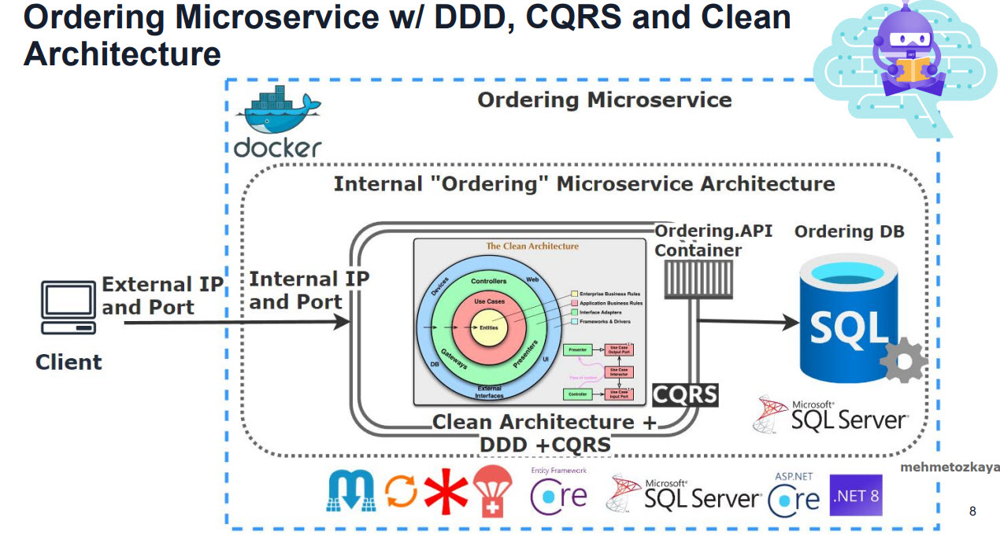
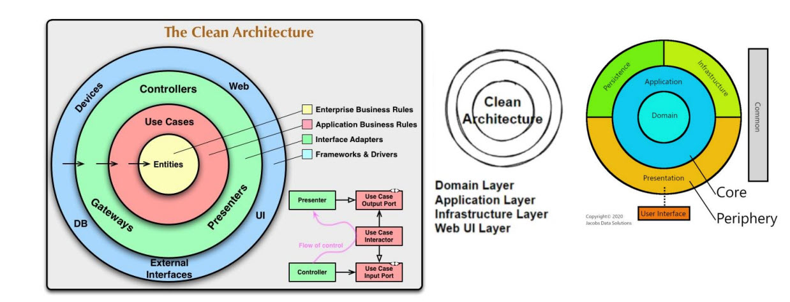
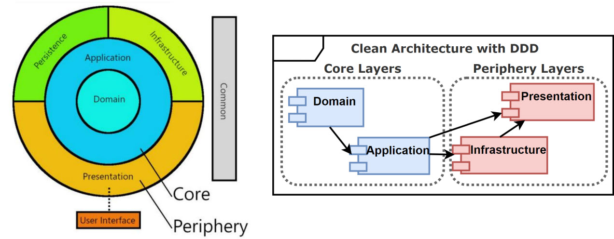
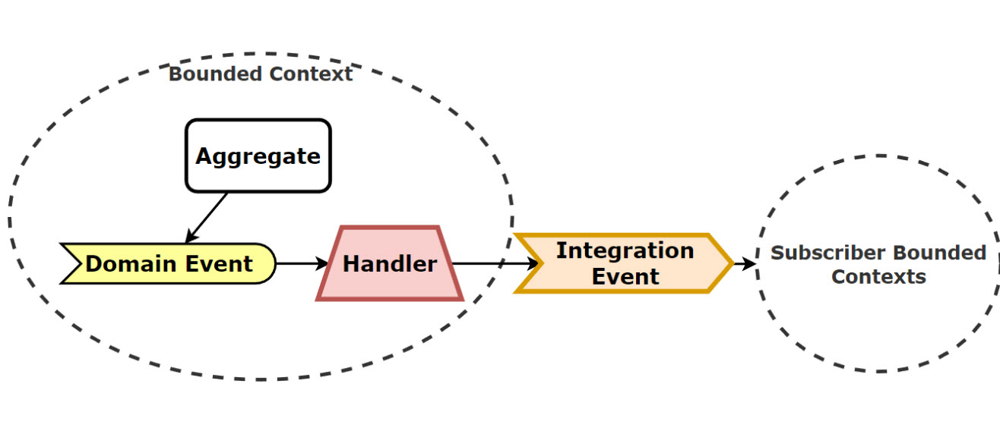
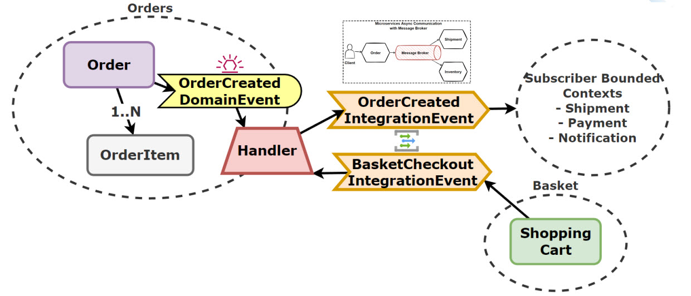
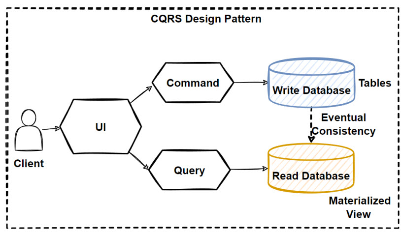
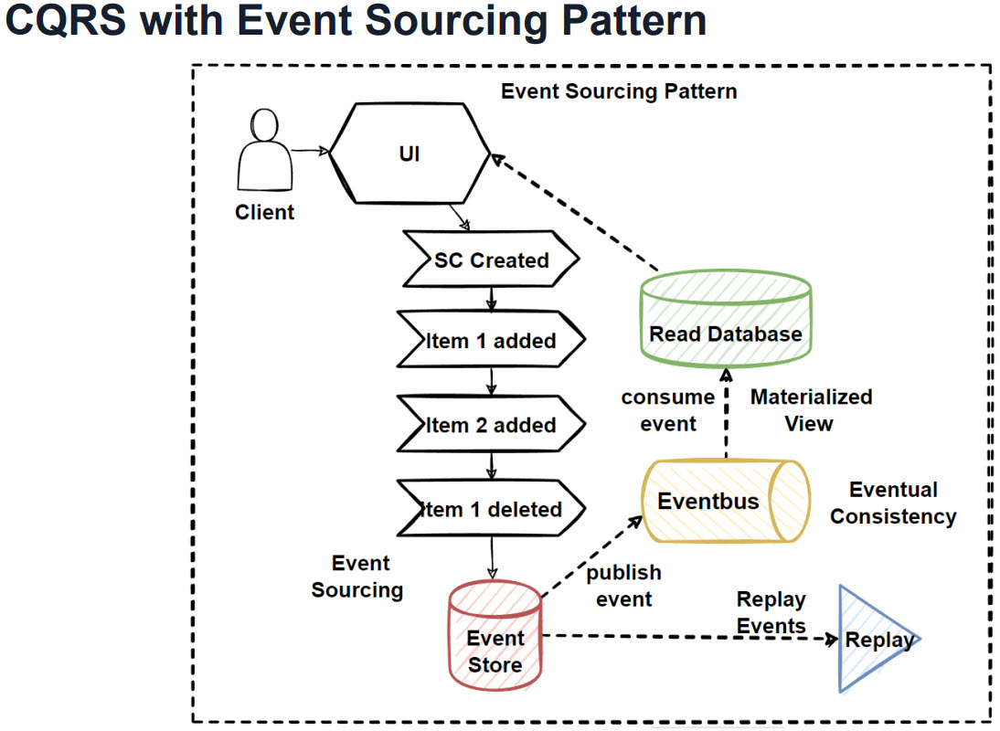
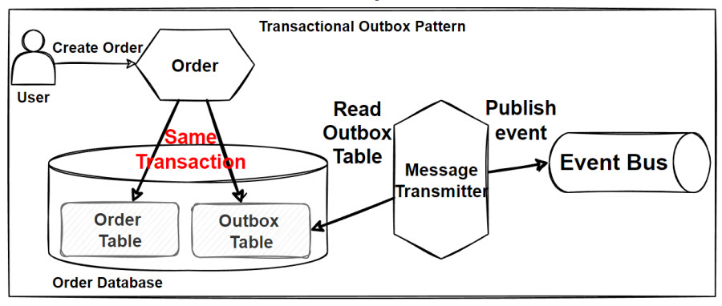
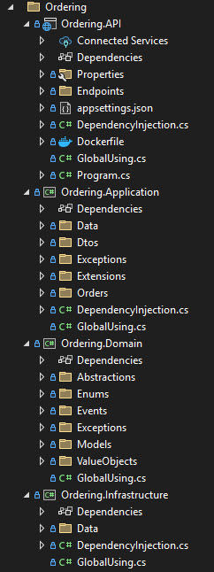
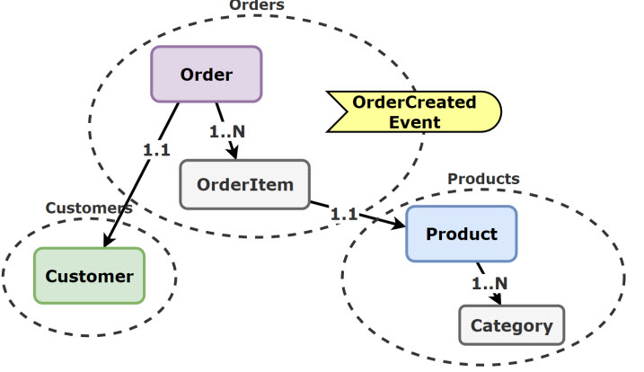

# Ordering.API

The Ordering API is a managing order operations in the application. It allows:

- CRUD order with items

- Basket checkout

- Order fulfillment

## Getting Started

You can run the project with the following ways:

- Visual Studio 2022
  
  | Profile        | Description                                                                                                                    |
  | -------------- | ------------------------------------------------------------------------------------------------------------------------------ |
  | Web            | The web profile hosts the application under the port 5003 for http and port 5053 for https.                                    |
  | Docker         | The docker profile exposes http at 8080 and https at 8081.                                                                     |
  | Docker Compose | The docker compose contains all microservices and their dependencies in this solution. Exposes http at 6003 and https at 6063. |

- Visual Studio Code

## Architecture

The Basket API is built using [Clean Architecture](https://learn.microsoft.com/en-us/dotnet/architecture/modern-web-apps-azure/common-web-application-architectures#clean-architecture) + Domain Driven Design. It aims to separate concerns and create systems that are independent of frameworks, UI, and databases. 

- Entity, Aggregate, Value Objects, Domain Events
- Anemic Domain, Rich Domain Entities

The Domain Events are handled using the MediatR to publish events.

- [CQRS](https://learn.microsoft.com/en-us/azure/architecture/patterns/cqrs)

- [Materialized View Pattern](https://learn.microsoft.com/en-us/azure/architecture/patterns/materialized-view)

- [Event Sourcing Pattern](https://learn.microsoft.com/en-us/azure/architecture/patterns/event-sourcing)

The project consists of the following components:

| Component                                                                                                             | Description                                                                                                                                                                                                                                                                                                                                                                                                                                                                     |
| --------------------------------------------------------------------------------------------------------------------- | ------------------------------------------------------------------------------------------------------------------------------------------------------------------------------------------------------------------------------------------------------------------------------------------------------------------------------------------------------------------------------------------------------------------------------------------------------------------------------- |
| [SQL Server](https://learn.microsoft.com/en-us/sql/sql-server/)                                                       | A relational database (SQL Server) is used for storing Orders and OrderItems                                                                                                                                                                                                                                                                                                                                                                                                    |
| [EF Core](https://github.com/dotnet/efcore)                                                                           | ORM for database operations.                                                                                                                                                                                                                                                                                                                                                                                                                                                    |
| [Redis Cache](https://www.nuget.org/packages/microsoft.extensions.caching.stackexchangeredis)                         | A powerful in-memory data store and distributed cache which is good fit for microservices arcihtecture.  The following design patterns are used:   - [Proxy Pattern](https://refactoring.guru/design-patterns/proxy/csharp/example) + [Decorator Pattern](https://refactoring.guru/design-patterns/decorator/csharp/example) + Scrutor   - [Cache aside Pattern](https://learn.microsoft.com/en-us/azure/architecture/patterns/cache-aside)/ Cache Invalidation |
| [MediatR](https://github.com/jbogard/MediatR)                                                                         | MediatR helps to implement the [Mediator pattern](https://refactoring.guru/design-patterns/mediator) and [CQRS pattern](https://learn.microsoft.com/en-us/azure/architecture/patterns/cqrs), which promotes loose coupling between components by allowing them to communicate through a central mediator rather than directly.  Uses `IPipelineBehavior` to introduce middleware concept.                                                                               |
| [Fast Endpoints](https://github.com/FastEndpoints/FastEndpoints)                                                      | Routing and handling HTTP requests, easier to define API endpoints with clean and concise code.                                                                                                                                                                                                                                                                                                                                                                                 |
| [Mapster](https://github.com/MapsterMapper/Mapster)                                                                   | Mapster is a fast, configurable object mapper that simplifies the task of mapping objects.                                                                                                                                                                                                                                                                                                                                                                                      |
| [Fluent Validation](https://github.com/FluentValidation/FluentValidation)                                             | For building strongly-typed validation rules, ensure inputs are correct before processed.                                                                                                                                                                                                                                                                                                                                                                                       |
| [Microsoft.AspNetCore.OpenApi](https://learn.microsoft.com/en-us/aspnet/core/fundamentals/openapi/aspnetcore-openapi) | Provides built-in support for OpenAPI document generation in ASP.NET Core.                                                                                                                                                                                                                                                                                                                                                                                                      |
| [Openapi-generator](https://github.com/OpenAPITools/openapi-generator)                                                | OpenAPI Generator allows generation of API client libraries (SDK generation), server stubs, documentation and configuration automatically given an OpenAPI Spec (v2, v3)                                                                                                                                                                                                                                                                                                        |
| [RestEase](https://github.com/canton7/RestEase)                                                                       | Easy-to-use typesafe REST API client library for .NET Standard 1.1 and .NET Framework 4.5 and higher, which is simple and customisable. Inspired by Refit                                                                                                                                                                                                                                                                                                                       |
| [Health Checks](https://github.com/Xabaril/AspNetCore.Diagnostics.HealthChecks)                                       | Enterprise HealthChecks for ASP.NET Core Diagnostics Package                                                                                                                                                                                                                                                                                                                                                                                                                    |

The common design patterns used in Clean Architecture include:

| Concept | Description                                                                                                                                    |
| ------- | ---------------------------------------------------------------------------------------------------------------------------------------------- |
| SOLID   | S = Seperation of Concern O = Open-Closed Principle L = Liskov Substitution I = Interface Segregation D = Dependency Inversion |
| ACID    | A = Atomicity C = Consistency I = Isolation D = Durability                                                                         |
| KISS    | Keep It Simple, Stupid                                                                                                                         |
| YAGNI   | You Aren't Gonna Need it                                                                                                                       |

Apart from the exposed Restful APIs, the Basket microservice also uses the following communication protocols:

- gRPC

## Project Structure

This project is organized in the following ways:

| Layer   | Description                                                                                       |
| ------- | ------------------------------------------------------------------------------------------------- |
| Feature | Each features like CheckoutBasket and GetBasket have dedicated handlers and endpoint definitions. |
| Model   | Contains the entities used by the Feature.                       |
| Data    | Contains Repository objects that manages database and cache interactions.                         |
| Dtos    | DTO (Data Transfer Objects).                                                                      |
| Protos  | Contains protobuf configurations.                                                                 |